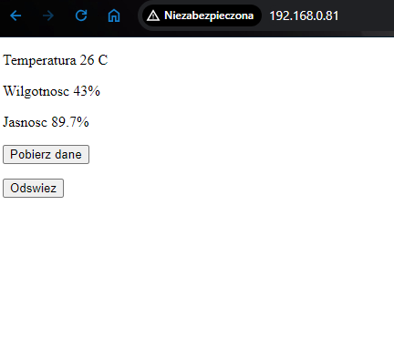
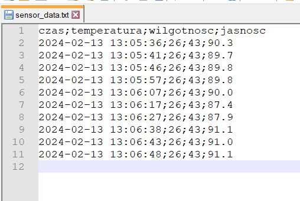
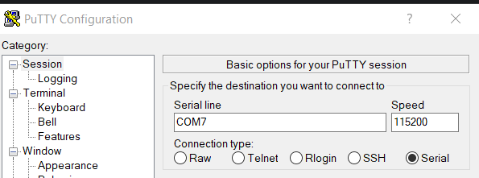
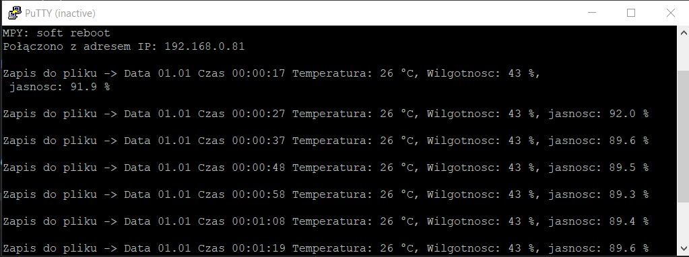
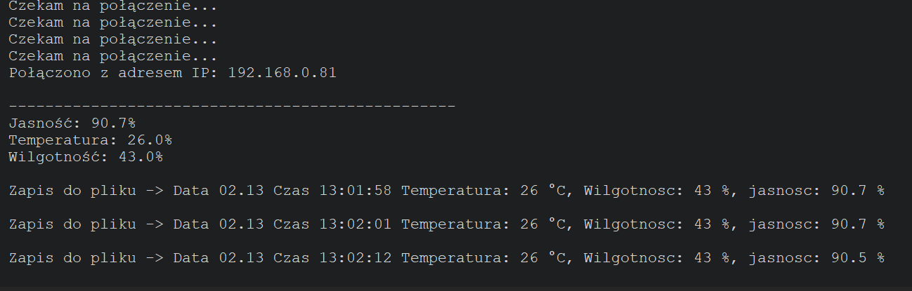
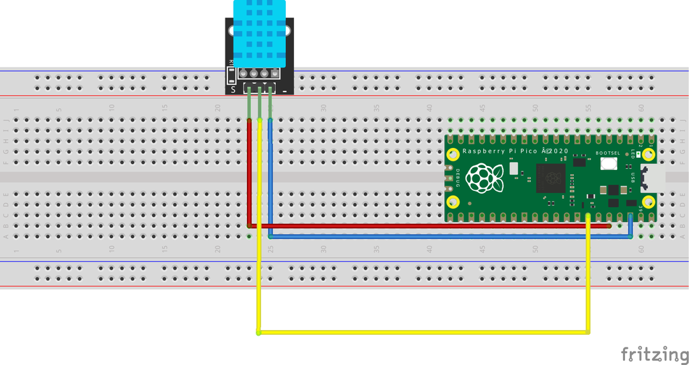
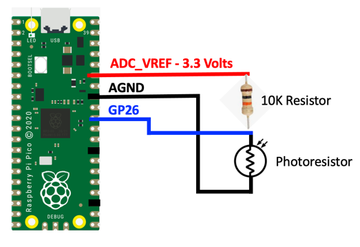

# Raspberry Pi Pico Weather Station - kurs Systemy czasu rzeczywistego

Projekt stacji pogodowej oparty na Raspberry Pi Pico W z wykorzystaniem czujników DHT11 i fotorezystora. Raspberry Pi Pico poprzez czujnik i fotorezystor zbiera dane:
- temperaturę
- wilgotność
- jasność (natężenie światła).

Mikrokontroler umożliwia podejrzenie pomiarów poprzez prosty html:



Co określony czas (domyślnie 10 minut) robiony jest zrzut do pliku txt z danymi. Plik jest w formacie odpowiednim do np. robienia wykresów. Zapis do pliku jest oddzielnym wątkiem od głównej pętli nasłuchującej. Obecnie przy każdym restarcie płyki plik z danymi jest czyszczony, aby nie zaśmiecać pamięci RPI Pico.



Poprzez serial (np. Putty) można podejrzeć logi

### Putty




### Powłoka Thonny


## Wymagania

- Raspberry Pi Pico W
- Czujnik DHT11
- Fotorezystor
- Połączenie z siecią WiFi
- Python 3.10
- microPython dla Raspberry Pi Pico W

````
# Requirements.txt
adafruit-ampy==1.0.7
click==8.1.7
colorama==0.4.6
docopt==0.6.2
picozero==0.4.1
pyserial==3.5
python-dotenv==1.0.1
uflash==1.2.4
````

## Konfiguracja

```python
# Konfiguracja WiFi
ssid = "Twoja_Sieć_WiFi"
password = "Twoje_Hasło"
```
### DHT11
```python
# Podpięcie DHT11 do pinu
dht_pin = machine.Pin(16)
# Zasilanie z pinu 3.3V
```


### Fotorezystor
```python
# Podpięcie fotorezystora do pinu
photo_pin = ADC(Pin(26))
# Zasilanie z pinu 3.3V
```

